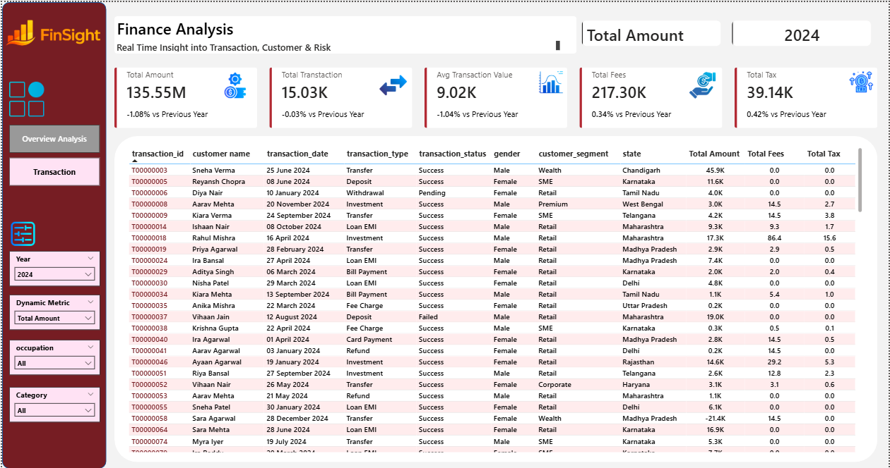

# 📊 Finance Analysis Dashboard - Power BI Project

Selamat datang di repositori proyek analisis keuangan ini. Dashboard interaktif ini dibangun menggunakan Power BI untuk memberikan *real-time insight* terkait performa transaksi, perilaku pelanggan, dan metrik risiko. File proyek utama dapat diakses pada `finance_analyst.pbix`.

## 📸 Dashboard Preview

**1. Overview Analysis**

**2. Transaction Details**

## 🎯 Gambaran Proyek
Dashboard ini dirancang untuk memantau metrik utama keuangan seperti total pendapatan, volume transaksi, pajak, dan biaya tambahan (*fees*), lengkap dengan perbandingan performa *Year-over-Year* (YoY). 

Proyek ini terbagi menjadi dua halaman fungsional utama:
1. **Overview Analysis**: Menampilkan visualisasi tingkat tinggi (*High-level KPIs*) dan tren performa berdasarkan waktu, demografi, lokasi geografis (*State*), serta status transaksi.
2. **Transaction**: Berisi tabel detail transaksi tingkat granular yang memungkinkan eksplorasi data spesifik melalui fungsionalitas *drill-down* ke *underlying data* dan panel filter dinamis.

## ✨ Fitur Utama & Visualisasi
* **Dynamic Metric Selection**: Menggunakan fitur Parameter Field dari DAX yang memungkinkan pengguna mengganti metrik utama (Total Amount, Total Fees, Total Tax, atau Total Transaction) secara interaktif, yang kemudian akan otomatis mengubah visualisasi di seluruh *chart*.
* **Time Intelligence DAX**: Perhitungan KPI berjalan vs periode tahun sebelumnya secara otomatis (YoY %), seperti pada metrik KPI Total Amount.
* **Trend & Status Analysis**: Grafik area berseri (*smooth line*) yang menunjukkan fluktuasi metrik dari bulan ke bulan, serta grafik donat proporsional untuk melacak status transaksi (*Success, Failed, Pending*).
* **Demographic & Geographic Breakdown**: Analisis pendapatan komprehensif berdasarkan *State* (grafik batang mendatar), Segmen Pelanggan (*Retail, Premium, SME, Corporate, Wealth*), dan *Gender* (*Male/Female*).
* **Transaction Type Matrix**: Tabel matriks bersyarat (*conditional formatting background*) yang memecah metrik berdasarkan jenis transaksi spesifik (*Bill Payment, Deposit, Investment, Loan EMI, Transfer, dll.*).
* **Detailed Filter Panel**: Panel sisi kiri yang mencakup navigasi halaman dan filter *multi-select* berdasarkan Tahun, Metrik Dinamis, Pekerjaan (*Occupation*), dan Kategori Merchant.

## 🛠️ Alat & Teknologi yang Digunakan
Proyek ini mendemonstrasikan pemanfaatan fungsionalitas tingkat lanjut di dalam ekosistem analitik data, terintegrasi dengan *tech stack* data analitik secara umum:
* **Visualisasi & Pemodelan Data**: Power BI Desktop, DAX (*Data Analysis Expressions*), Power Query, Tableau.
* **Manipulasi & Analisis Ekstra**: SQL, Python, Excel.

## 🔗 Referensi
Proyek ini dikembangkan dan diadaptasi berdasarkan referensi pembelajaran dari tutorial YouTube berikut: 
* [Power BI Project | Finance Analysis Part 2 End to End by Data Tutorials](https://www.youtube.com/watch?v=97zcTmOOZS0)
